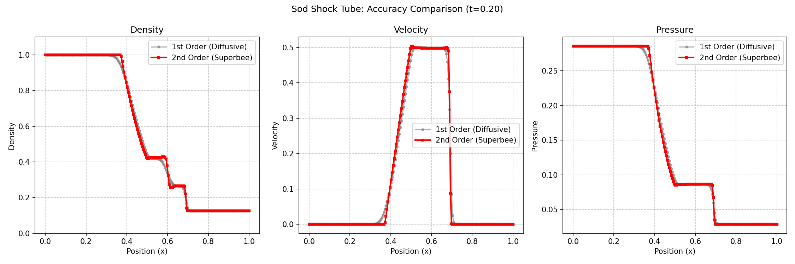

# Fluxus: Computational Fluid Dynamics Library

**Fluxus** is a modular Finite Volume solver for the Euler equations of fluid dynamics. It features a hybrid architecture: the heavy lifting (numerical flux loops) is implemented in **C++**, while the simulation setup, initialization, and post-processing are handled in **Python**.

## 🚀 Key Features

* **Hybrid Architecture:** C++ core for performance, Python interface for ease of use
* **Modular Physics Stack:** Mix and match Riemann solvers, time integrators, and reconstructors
* **High-Order Schemes:** 2nd-order MUSCL-Hancock with TVD limiters (Minmod, Superbee, Van Leer)
* **Source Terms:** Modular system for external forces (Gravity, etc.)
* **Flexible Boundaries:** Transmissive, Reflective, and Periodic boundary conditions

---

## 🛠 Architecture

### Core (C++)

**Riemann Solvers:** Compute flux across cell interfaces

- `HLLSolver`: Basic HLL solver
- `HLLCSolver`: Restores contact discontinuities
- `RoeSolver`: Linearized Riemann solver with entropy fix

**Reconstructors:** Spatial reconstruction at cell faces

- `PiecewiseConstantReconstructor`: 1st order
- `MinmodReconstructor`: 2nd order, TVD-stable
- `SuperbeeReconstructor`: 2nd order, sharp shocks
- `VanLeerReconstructor`: 2nd order, smooth

**Time Integrators:** Advance solution in time

- `GodunovIntegrator`: 1st order explicit (with optional reconstruction)
- `MUSCLHancockIntegrator`: 2nd order predictor-corrector

**Source Terms:** External forces

- `Gravity`: Constant gravitational acceleration

### Simulation (Python)

- `Simulation` class: High-level interface for running simulations
- Callback system for analysis and visualization
- Automatic CFL-based time stepping
- Initial condition setup via function interface

### Analysis (In Development)

Planned modules for data extraction and physics diagnostics:

- Primitive variable extraction
- Derived quantities (vorticity, Mach number, etc.)
- Conservation property tracking
- Metrics collection system

### I/O (In Development)

Planned modules for data persistence:

- HDF5 checkpointing and restart
- VTK/XDMF export for ParaView
- Time series management

### Visualization (In Development)

Planned modules for real-time and post-processing visualization:

- 1D/2D live plotting
- Multi-panel dashboards
- Metrics display integration

---

## 📦 Installation

**Requirements:**

- C++17 compliant compiler
- CMake 3.15+
- Python 3.8+
- pybind11
- NumPy
- Matplotlib

```bash
git clone https://github.com/KaiCarmin/fluxus.git
cd fluxus
pip install -e .
```

## 📖 Examples

### Sod Shock Tube (`examples/sod-shock-tube/`)

Classic 1D Riemann problem demonstrating shock, rarefaction, and contact discontinuity. The comparison example shows the accuracy difference between 1st-order (Godunov + Piecewise Constant) and 2nd-order (MUSCL-Hancock + Superbee) schemes. The 2nd-order method captures sharper discontinuities with less numerical diffusion.



**Rayleigh-Taylor Instability** (`examples/rayleigh-taylor/`): 2D hydrodynamic instability with gravity

## 🗺️ Roadmap

See [ProjectPlan.md](ProjectPlan.md) for detailed development phases:

- ✅ Core physics engine (C++)
  - 🚧Add Runge-Kutta integrators
- ✅ Simulation runner (Python)
- 🚧 Analysis module (data extraction, diagnostics)
- 🚧 I/O module (HDF5, VTK export)
- 🚧 Visualization module (real-time plotting, dashboards)
